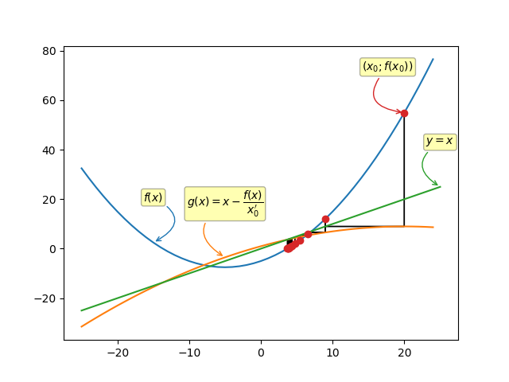
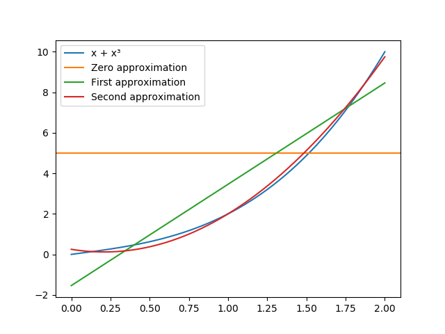

# ModifiedNewtonFixedPointIteration


# LagrangePolynomial
Lagrange polynomial interpolation using zeros of Chebyshev series.
## Result:


# NonlinearRelaxation
Based on [my paper](NonlinearRelaxation/paper.pdf).

# UniformApproximation
The best uniform approximation is the approximation in space 
,
<!---\left \| f \right \|_{C\left [ a,b \right ]} = \max_{x\epsilon \left [ a,b \right ]} \left | f(x) \right |-->
where  — uniform metric.

## Result:


# SimpsonIntegration
<!---{\int \limits _{a}^{b}f(x)dx}\approx {\frac  {b-a}{6}}{\left(f(a)+4f\left({\frac  {a+b}{2}}\right)+f(b)\right)}-->

## Output
```
Simpson:
	256	1.7076842519339281	1.7083880026331157
True value:
	1.718281828459045
```